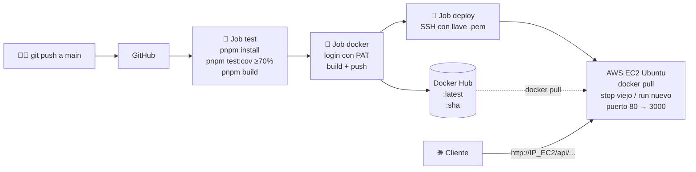

# 🚀 API REST NestJS con pipeline CI/CD

API REST genérica (usuarios, productos, categorías, órdenes, clientes, proveedores, tareas y notas) hecha en **NestJS**, probada con **Jest**, empaquetada con **Docker** y desplegada automáticamente en **AWS EC2** con **GitHub Actions**.

- **73 endpoints** funcionales
- Pruebas unitarias + de integración (e2e) con **cobertura mínima de 70%** (el pipeline falla si baja)
- Imagen Docker multi-stage publicada en Docker Hub con tags `:latest` y `:<commit sha>`
- Deploy automático en EC2 en cada `push` a `main`
- Cero secretos en el código: todo va en **GitHub Secrets**

---

## 🏗️ Arquitectura



| Pieza | Tecnología |
|---|---|
| Framework | NestJS 11 (Node 22, TypeScript) |
| Pruebas | Jest + ts-jest + Supertest |
| Gestor de paquetes | pnpm |
| Contenedor | Docker (multi-stage, `node:22-alpine`, usuario no-root) |
| CI/CD | GitHub Actions (`.github/workflows/main.yml`) |
| Registro | Docker Hub |
| Servidor | AWS EC2 Ubuntu Server + Docker |

Los datos se guardan **en memoria** (se reinician al reiniciar el contenedor); el objetivo del proyecto es el pipeline, no la base de datos.

### Estructura

```
src/
├── common/              # Servicio y controlador CRUD genéricos (8 endpoints c/u)
├── config/app.config.ts # Mensaje/versión de la API (lo que se cambia en la demo)
├── health/              # /api/health, /api/health/ping, /api/info
├── users/  products/  categories/  orders/
├── customers/  suppliers/  tasks/  notes/
├── app.module.ts
├── app.setup.ts         # Prefijo /api, CORS (compartido con los tests)
└── main.ts
test/app.e2e-spec.ts     # Pruebas de integración HTTP de todos los endpoints
```

---

## 📚 Endpoints (73)

Prefijo global: `/api`

### Health (3)
| Método | Ruta | Descripción |
|---|---|---|
| GET | `/api/health` | Estado y mensaje de la API |
| GET | `/api/health/ping` | `{ "pong": true }` (healthcheck de Docker) |
| GET | `/api/info` | Nombre, versión y **commit desplegado** |

### CRUD — 8 endpoints por cada recurso (8 × 8 = 64)
Recursos: `users`, `products`, `categories`, `orders`, `customers`, `suppliers`, `tasks`, `notes`

| Método | Ruta | Descripción |
|---|---|---|
| GET | `/api/<recurso>` | Lista todos |
| GET | `/api/<recurso>/count` | Total de registros |
| GET | `/api/<recurso>/search?q=texto` | Búsqueda por texto |
| GET | `/api/<recurso>/:id` | Obtiene uno |
| POST | `/api/<recurso>` | Crea |
| PUT | `/api/<recurso>/:id` | Reemplaza |
| PATCH | `/api/<recurso>/:id` | Actualiza parcial |
| DELETE | `/api/<recurso>/:id` | Elimina |

### Extras (6)
| Método | Ruta | Body |
|---|---|---|
| PATCH | `/api/users/:id/deactivate` | — |
| GET | `/api/products/low-stock?max=5` | — |
| PATCH | `/api/products/:id/stock` | `{ "quantity": -2 }` |
| PATCH | `/api/orders/:id/status` | `{ "status": "paid" }` |
| GET | `/api/tasks/pending` | — |
| PATCH | `/api/tasks/:id/complete` | — |

### Campos obligatorios al crear
| Recurso | Obligatorios | Opcionales |
|---|---|---|
| users | `name`, `email` (único) | `role`, `active` |
| products | `name`, `price` (≥ 0) | `stock`, `categoryId` |
| categories | `name` | `description` |
| orders | `customerId`, `total` | `status` (`pending`, `paid`, `shipped`, `delivered`, `cancelled`) |
| customers | `name`, `email` | `phone` |
| suppliers | `name` | `contact`, `phone` |
| tasks | `title` | `description`, `priority`, `completed` |
| notes | `title`, `content` | — |

Ejemplo:
```bash
curl -X POST http://localhost:3000/api/products \
  -H "Content-Type: application/json" \
  -d '{"name":"Monitor","price":3500,"stock":7}'
```

---

## 💻 Comandos locales

Requisitos: Node 22+, pnpm 10, Docker.

```bash
pnpm install            # instala dependencias (genera pnpm-lock.yaml)
pnpm start:dev          # modo desarrollo -> http://localhost:3000/api/health
pnpm test               # corre las pruebas
pnpm test:cov           # pruebas + reporte de cobertura (falla si < 70%)
pnpm build              # compila a dist/
pnpm start:prod         # corre la versión compilada
```

Con Docker:
```bash
docker build -t api-cicd-nest .
docker run -d --name api-cicd-nest -p 80:3000 api-cicd-nest
curl http://localhost/api/health
```

El reporte HTML de cobertura queda en `coverage/lcov-report/index.html`.

---

## ⚙️ Configuración del pipeline

### 1. Docker Hub — Personal Access Token
1. Docker Hub → **Account settings → Personal access tokens → Generate new token**.
2. Permisos: **Read, Write, Delete**. Copia el token (solo se muestra una vez).

### 2. AWS EC2
1. **Launch instance** → AMI **Ubuntu Server 24.04 LTS**, tipo `t2.micro` / `t3.micro`.
2. **Key pair**: crea uno tipo RSA, formato `.pem` y descárgalo.
3. **Security Group** (reglas de entrada):

   | Tipo | Puerto | Origen |
   |---|---|---|
   | SSH | 22 | 0.0.0.0/0 (los runners de GitHub cambian de IP) |
   | HTTP | 80 | 0.0.0.0/0 |

4. Conéctate e instala Docker:
   ```bash
   chmod 400 mi-llave.pem
   ssh -i mi-llave.pem ubuntu@<IP_EC2>

   # dentro de la EC2:
   sudo apt update && sudo apt install -y docker.io curl
   sudo systemctl enable --now docker
   sudo usermod -aG docker ubuntu
   exit   # vuelve a entrar para que aplique el grupo docker
   ```
5. Verifica: `ssh -i mi-llave.pem ubuntu@<IP_EC2> docker ps` (debe funcionar sin `sudo`).

> 💡 Recomendado: asigna una **Elastic IP** a la instancia para que la IP no cambie al reiniciarla.

### 3. GitHub Secrets
Repositorio → **Settings → Secrets and variables → Actions → New repository secret**:

| Secret | Valor |
|---|---|
| `DOCKERHUB_USERNAME` | Tu usuario de Docker Hub |
| `DOCKERHUB_TOKEN` | El Personal Access Token |
| `EC2_HOST` | IP pública de la EC2 |
| `EC2_USER` | `ubuntu` |
| `EC2_SSH_KEY` | Contenido **completo** del `.pem` (incluyendo `-----BEGIN ...` y `-----END ...`) |

### 4. Qué hace el workflow (`.github/workflows/main.yml`)
| Job | Cuándo corre | Qué hace |
|---|---|---|
| 🧪 `test` | push y pull_request a `main` | Instala, corre `pnpm test:cov`, imprime la cobertura en los logs y en el resumen del job, compila |
| 🐳 `docker` | solo push a `main` | Login con PAT, build multi-stage, push con tags `:latest` y `:${{ github.sha }}` |
| 🚀 `deploy` | solo push a `main` | SSH a la EC2, `docker pull`, detiene el contenedor viejo, levanta el nuevo en el puerto 80 y verifica `/api/health` |

Para minimizar el tiempo fuera de servicio, la imagen nueva se descarga **antes** de detener la anterior, así el cambio de contenedor tarda solo un par de segundos. El contenedor usa `--restart unless-stopped`, así que vuelve a levantarse si la EC2 se reinicia.

---

## 🎬 Demostración en vivo

1. Abre `http://<IP_EC2>/api/health` → `"message": "🚀 API desplegada con CI/CD - v1"`.
2. Edita `src/config/app.config.ts` y cambia el mensaje (por ejemplo `v1` → `v2`).
3. Sube el cambio:
   ```bash
   git add .
   git commit -m "demo: cambia mensaje a v2"
   git push origin main
   ```
4. En **GitHub → Actions** se ve: pruebas ✅ → imagen en Docker Hub ✅ → deploy ✅.
5. Recarga `http://<IP_EC2>/api/health` → ya dice `v2`. En `http://<IP_EC2>/api/info` el `commit` coincide con el hash del push y con el tag nuevo en Docker Hub.

---

## 🔒 Seguridad
- Ninguna contraseña, IP, token ni llave está en el código: todo se lee de **GitHub Secrets**.
- `.gitignore` y `.dockerignore` excluyen `.env`, `*.pem`, `node_modules`, logs, etc.
- La imagen final corre con el usuario **no-root** `node` y no incluye devDependencies ni código fuente TypeScript.
